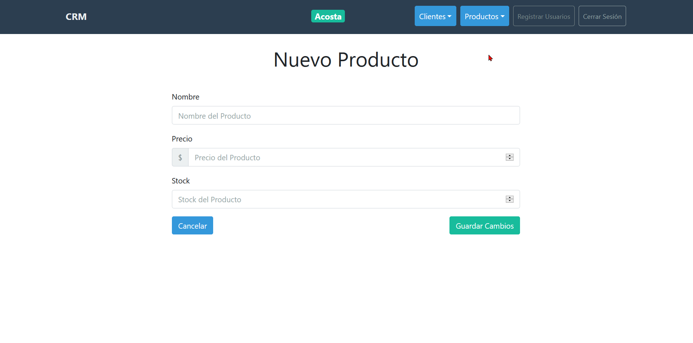
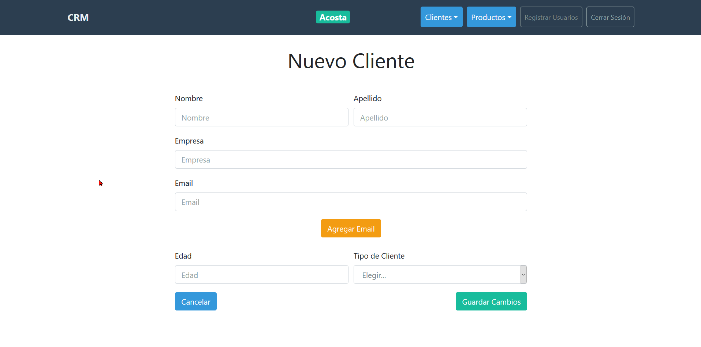
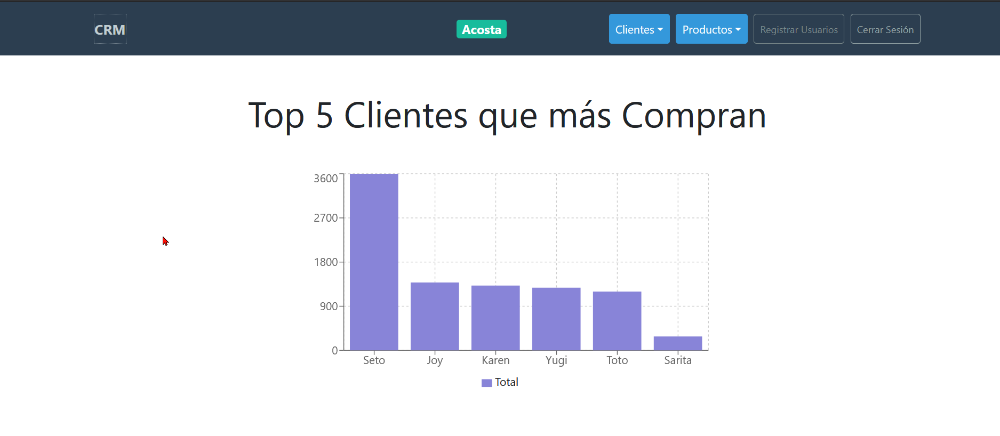

# Proyecto de un **CMR** construido con React y GraphQL

Para iniciar ingresamos a la carpeta server y ejecutamos `npm install` y luego `npm start`, luego hacemos lo mismo en la carpeta client.

## Tenemos una lista de clientes.

## Una lista de productos

## Podemos crear nuevos productos

## Crear nuevos clientes

## Ver gráficas de clientes

### Y muchas cosas más como roles administradores y vendedores, registro de nuevos vendedores, gráficas de vendedores entre otras características.