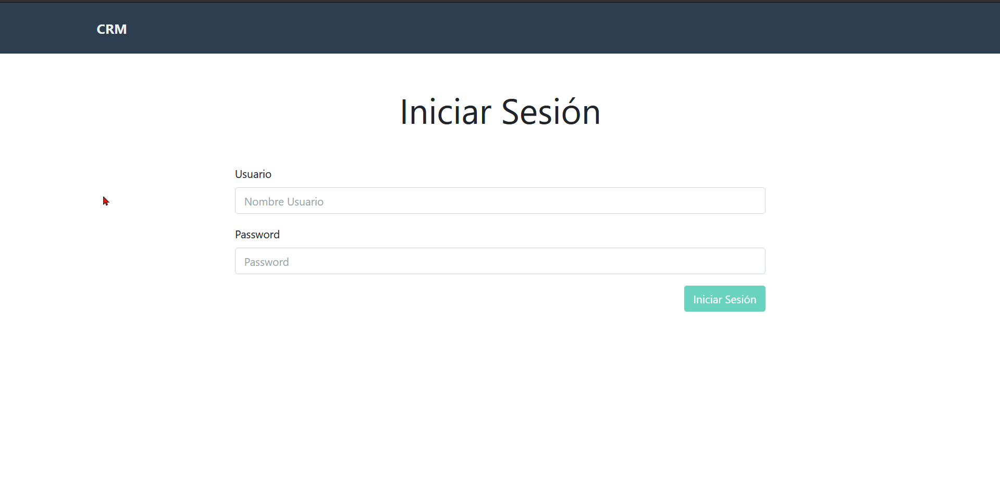
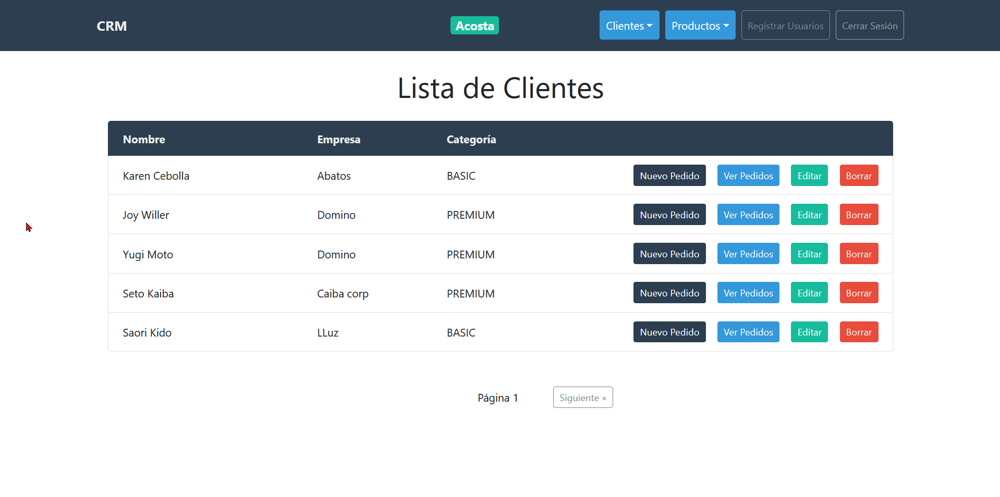
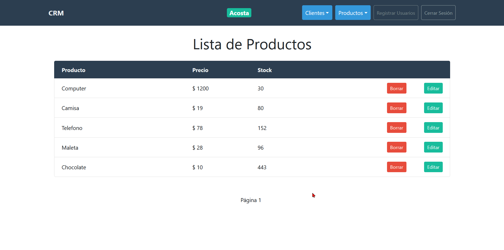

# Proyecto de un **CMR** construido con React y GraphQL

Para iniciar ingresamos a la carpeta server y ejecutamos `npm install` y luego `npm start`, luego hacemos lo mismo en la carpeta client.

### Tenemos una lista de clientes.

### Una lista de productos

